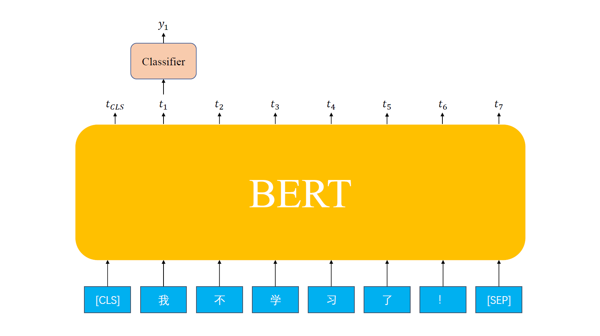
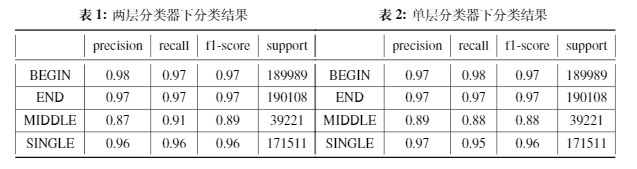

# Bert中文分词

## 1.中文分词问题定义

在深度学习领域，中文分词问题可以定义为：给定中文句子序列$c_1c_2...c_n$，对其进行序列标注，得到字符序列的分类结果序列$y_1y_2...y_n $，其中$y_i\in [B,E,M,S]$，其中$B$代表该字符为词的开始字符，$E$代表该字符为词的结束字符，$M$代表该字符在一个词的中间，$S$代表该字符单字成词。

## 2.分词算法

有了如上思路，可以很简单地采用序列标注的模型对该问题进行建模。在本次探究中，由于分词语料的数量并不算多，所以考虑采用最近特别火的预训练模型BERT作为基础模型，在预训练模型上利用分词语料进行微调。假设例句为“我不学习了！”，输入BERT前，该句子前后需要加入特定标识符[CLS]与[SEP]，随后BERT对其进行处理得到该序列的表示向量$[t_{CLS},t_1,t_2,...,t_6,t_{SEP}]$，利用分类网络对得到的每个字符的表示向量进行分类，即可完成中文分词任务。模型结构图如下：



## 3.数据集以及预处理

数据集上，选用[The Second International Chinese Word Segmentation Bakeoff](http://sighan.cs.uchicago.edu/bakeoff2005/)中提供的四个中文分词语料，分别为：

- **Academia Sinica**
- **CityU**
- **Peking University**
- **Microsoft Research**

为了使得训练语料尽可能多，将四个分词语料合并进行训练。预处理方面进行以下操作：

- 将CityU与Academia Sinica语料中的繁体字转换为简体字
- 将所有语料中的全角字符转换为半角字符
- 所有英文字母变为小写
- 对于语料中的每个词，对其进行中文字符级别的切分，保留英文单词以及数字
- 切分完毕后，生成序列对应的分词标注，并保存到一个json文件中

除此之外，在实际上手时，发现bert的tokenizer会对英文单词进行进一步的拆解，为了简便起见，对于该拆分的单词，其对应的标注方法同中文词。由于语料中英文单词的比重较少，该操作并不会对准确率造成较大影响。

## 4.实验结果

实验中采用huggingface提供的bert-base-chinese模型作为预训练模型，训练过程中采用batchsize=16，优化器为Adam，bert网络学习率设为1e-5，分类器部分学习率为1e-2。训练集与验证集比例为9:1，训练8个epoch并保存验证集loss最小时的模型。除此之外，由于显存有限，将最大的句子长度设置为300（数据集中长度大于300的句子只有约800条，远小于总数据量，可以忽略）。分类结果如下：



## 5.程序文件说明

```
│  .gitignore
│  configs.py
│  corpus_token_preprocess.py
│  data_view.ipynb
│  demo.ipynb
│  model-256-4.pt
│  model.pt
│  model.py
│  pipeline.py
│  preprocess.py
│  README.md
│  test.py
│  train_eval.py
│  utils.py
│  中文分词报告.pdf
│
├─data
│  │  test.id.json
│  │  test.json
│  │  train.id.json
│  │  train.json
│  │
│  └─icwb2-data
├─models
│  │  bertCWS-256-4.pt
│  │  bertCWS-4.pt
```

运行时先利用preprocess.py生成预处理数据文件(train.json, test.json)，随后利用corpus_token_preprocess.py将预处理数据文件转换为id序列文件(train.id.json, test.id.json)。然后就可以使用pipeline.py进行训练，训练配置见configs.py。测试可以使用test.py，demo效果见demo.ipynb。

